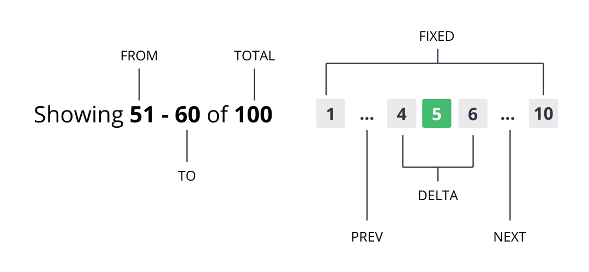

<h1 align="center">
  
</h1>

> A generic, framework agnostic, pagination calculator

### ✨ [Demo](https://codesandbox.io/s/4265rwmzlx)

## Install

```
yarn add pagix
```

## Basic Usage

```js
import { pagix } from 'pagix'

const paginate = pagix({ records: 100 })
```

The `pagix` function returns an object with some calculated props:

- **total**: total pages to show in pagination
- **current**: current page, between max and min total pages
- **start**: an array with pages before prev button
- **middle**: an array with pages between prev and next buttons
- **end**: an array with pages after next button
- **prev**: a page to set as current when click on prev button, or false
- **next**: a page to set as current when click on next button, or false
- **from**: initial record from current pagination
- **to**: last record from current pagination

## API

**pagix({ records [, limit, current, delta, fixed ] })**: Main method to calculate pagination



| Prop    | Required | Default | Description                                                     |
| ------- | -------- | ------- | --------------------------------------------------------------- |
| records | true     | -       | total of records to paginate                                    |
| limit   | false    | 10      | total of records to show per page                               |
| current | true     | 1       | current page                                                    |
| delta   | true     | 1       | total of pages to show in each side of current page             |
| fixed   | true     | 1       | total of pages to show before prev button and after next button |

## 🤝 Contributing

Contributions, issues and feature requests are welcome!<br  />Feel free to check [issues page](https://github.com/brunobertolini/pagix/issues). You can also take a look at the [contributing guide](https://github.com/brunobertolini/pagix/blob/master/CONTRIBUTING.md).

## Show your support

Give a ⭐️ if this project helped you!